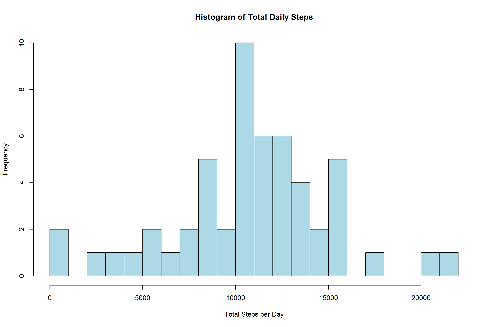
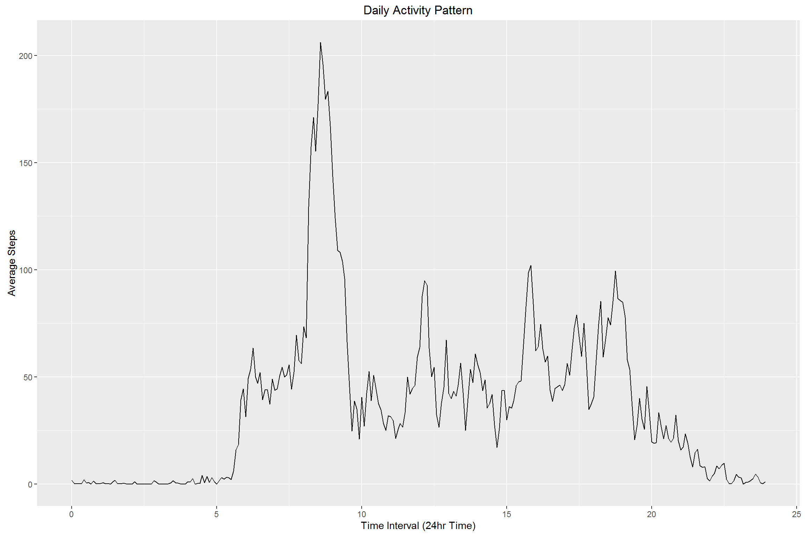
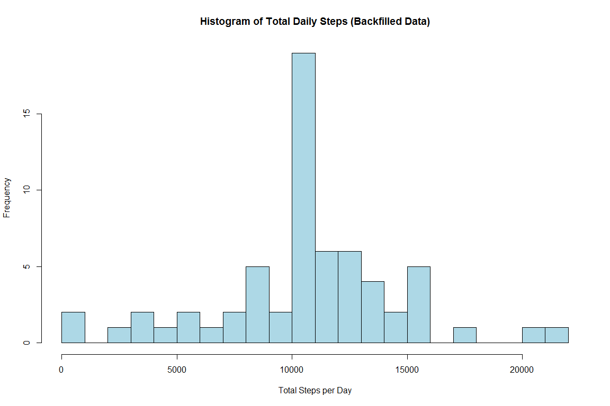

# Reproducible Research: Peer Assessment 1


## Loading and preprocessing the data


```r
library(reshape)

rawData = read.csv("activity.csv", header = TRUE)
hours <- as.integer(rawData[,"interval"] / 100)
minutes <- rawData[,"interval"] %% 100
decimalMinutes <- minutes/60
continuousTime <- hours + decimalMinutes
DTG <- as.POSIXct(paste(rawData$date, paste(hours, minutes, sep = ":"), sep = ""))
t <- format(DTG ,format = "%H:%M")
temp = melt(rawData, id=c("date","interval"))
activityData = cast(temp, interval ~ date, na.rm=TRUE)
```

## What is mean total number of steps taken per day?


```r
totalDailySteps = aggregate(. ~date, data=rawData, sum, na.rm=TRUE)
hist(totalDailySteps[,"steps"], plot = TRUE, breaks = 20, main = "Histogram of Total Daily Steps", col = "lightblue", xlab = "Total Steps per Day")
```

<!-- -->

```r
averageStepsPerDay = mean(totalDailySteps[,"steps"])
medianStepsPerDay = median(totalDailySteps[,"steps"])
```
The mean total number of steps taken per day is 10766.19. The median is 10765.


## What is the average daily activity pattern?

```r
library(ggplot2)
activityData$mean <- rowMeans(activityData[,-1], na.rm=TRUE)
activityData$continuousTime <- continuousTime[0:nrow(activityData)]
ggplot(activityData, aes(continuousTime, mean)) + geom_line() + xlab("Time Interval (24hr Time)") + ylab("Average Steps") + ggtitle("Daily Activity Pattern")
```

<!-- -->

```r
maximumSteps <- max(activityData$mean)
maximumStepsInterval <- t[which.max(activityData$mean)]
```
The data shows the greatest average activity between 07:30 and 10 am, with a peak of 206.17 in the 5 minutes following 08:35.

## Imputing missing values
In order to estimate the values that are missing, I have decided to make the assumption that this person maintains a very consistent daily routine, and simply use the average number of steps for that time interval to replace the missing value.

```r
activityDataModified <- cbind(activityData)

for(i in 1:nrow(activityDataModified)){
  activityDataModified[i, is.na(activityDataModified[i,])] <- activityDataModified$mean[i]
}

activityDataModified$mean <- rowMeans(activityDataModified[,2:(ncol(activityDataModified)-2)])

newTotalDailySteps <- colSums(activityDataModified)
hist(newTotalDailySteps[2:length(newTotalDailySteps)], plot = TRUE, breaks = 20, main = "Histogram of Total Daily Steps (Backfilled Data)", col = "lightblue", xlab = "Total Steps per Day")
```

<!-- -->

```r
nTDS <- newTotalDailySteps[2:length(newTotalDailySteps)]
newMeanSteps <- mean(nTDS)
newMedianSteps <- median(nTDS)
```

Having replace all NAs in the data with the average number of steps taken in the same time interval, we find that the mean number of steps each day is now 10649.96 and the median has become 10766.19.

## Are there differences in activity patterns between weekdays and weekends?
