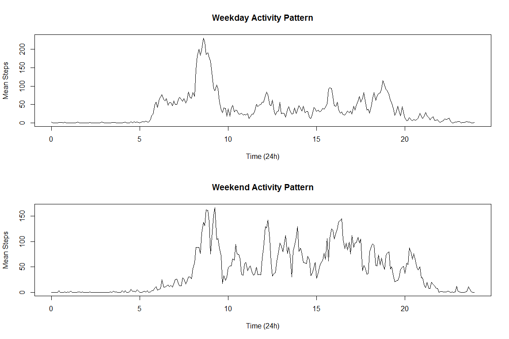

# Reproducible Research: Peer Assessment 1
Greg Stephenson  


## Loading and preprocessing the data

The data found in activity.csv requires minimal prepreocessing. The only significant change is to take the discrete, non-time formatted column 'interval' and convert it into a continuous numeric format so as not to skew the graphs later.


```r
rawData = read.csv("activity.csv", header = TRUE)
hours <- as.integer(rawData[,"interval"] / 100)
minutes <- rawData[,"interval"] %% 100
decimalMinutes <- minutes/60
continuousTime <- hours + decimalMinutes
```

## What is mean total number of steps taken per day?

Here I have simply aggregated the data based on the date column, summing all 'steps' entries for that date. Note that missing values are still present in the data.


```r
totalDailySteps = aggregate(. ~date, data=rawData, sum, na.rm=TRUE)
hist(totalDailySteps[,"steps"], plot = TRUE, breaks = 20, main = "Histogram of Total Daily Steps", col = "lightblue", xlab = "Total Steps per Day")
```

<!-- -->

```r
averageStepsPerDay = mean(totalDailySteps[,"steps"])
medianStepsPerDay = median(totalDailySteps[,"steps"])
```
The mean total number of steps taken per day is 10766.19. The median is 10765.

## What is the average daily activity pattern?

```r
library(ggplot2)
meanStepsPerInterval <- aggregate(. ~interval, data=rawData, mean, na.rm=TRUE)
meanStepsPerInterval$continuousTime <- continuousTime[1:nrow(meanStepsPerInterval)]
ggplot(meanStepsPerInterval, aes(continuousTime, steps)) + geom_line() + xlab("Time Interval (24hr Time)") + ylab("Average Steps") + ggtitle("Daily Activity Pattern")
```

<!-- -->

```r
maximumSteps <- max(meanStepsPerInterval$steps)
maximumStepsInterval <- meanStepsPerInterval$interval[which.max(meanStepsPerInterval$steps)]
```

The data shows the greatest average activity between 07:30 and 10 am, with a peak of 206.17 in the 5 minutes following 835.

## Imputing missing values

In order to estimate the values that are missing, I have decided to make the assumption that this person maintains a very consistent daily routine, and simply use the average number of steps for that time interval to replace the missing value.


```r
backFilledData <- read.csv("activity.csv", header = TRUE)
stepMeans <- meanStepsPerInterval$steps
repstepmeans <- rep(stepMeans, 61)
backFilledData$steps[is.na(backFilledData$steps)] <- repstepmeans

newTotalDailySteps = aggregate(. ~date, data=backFilledData, sum, na.rm=TRUE)
hist(newTotalDailySteps[,"steps"], plot = TRUE, breaks = 20, main = "Histogram of Total Daily Steps", col = "lightblue", xlab = "Total Steps per Day")
```

<!-- -->

```r
newAverageStepsPerDay = mean(newTotalDailySteps[,"steps"])
newMedianStepsPerDay = median(newTotalDailySteps[,"steps"])
```

Having replace all NAs in the data with the average number of steps taken in the same time interval, we find that the mean number of steps each day is now 10766.19 and the median has become 10766.19. Tjhese values are extremely close to the original data. We can also see the frequency of an average day has increased by over 50%, which makes sense given that any days for which there was no data have been filled with averaged data. The days with zero steps (forgoton to wear the fitbit perhaps) have been left at 0.

## Are there differences in activity patterns between weekdays and weekends?
To determine the answer to this question I have split the data into two frames and repeated the above method for producing an activity pattern chart.

```r
days <- factor(weekdays(as.Date(backFilledData$date)))
levels(days) <- c("WeekDay","WeekDay","WeekEnd", "WeekEnd","WeekDay","WeekDay","WeekDay")
backFilledData$wd <- days
test <- split(backFilledData, backFilledData$wd)
WeekDays <- as.data.frame(test[1])
WeekEnds <- as.data.frame(test[2])

WDSPI <- aggregate(. ~WeekDay.interval, data=WeekDays, mean, na.rm=TRUE)
WDSPI$continuousTime <- continuousTime[1:nrow(WDSPI)]

WESPI <- aggregate(. ~WeekEnd.interval, data=WeekEnds, mean, na.rm=TRUE)
WESPI$continuousTime <- continuousTime[1:nrow(WESPI)]

par(mfrow=c(2,1))
plot.ts(WDSPI$continuousTime, WDSPI$WeekDay.steps, type="l", main = "Weekday Activity Pattern", xlab = "Time (24h)", ylab = "Mean Steps")
plot.ts(WESPI$continuousTime, WESPI$WeekEnd.steps, type="l", main = "Weekend Activity Pattern", xlab = "Time (24h)", ylab = "Mean Steps")
```

<!-- -->

As we can see from the charts, while the peak value is actually slightly lower, the subject is more consistently average on the weekend. This may indicate employment in a sedentary job.
